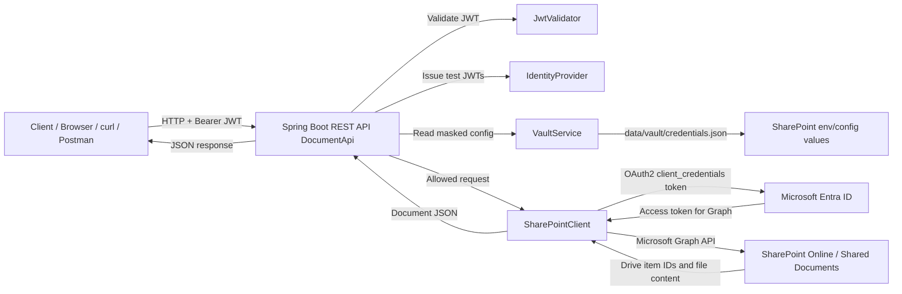
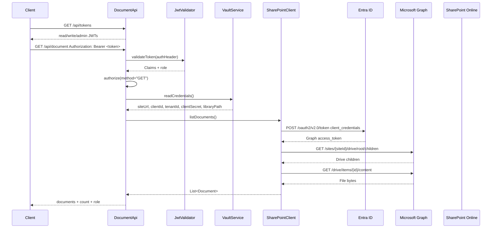
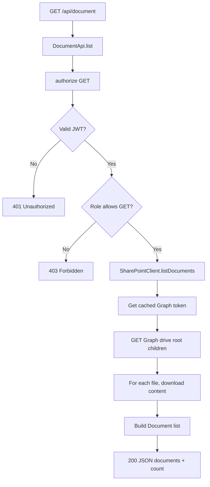
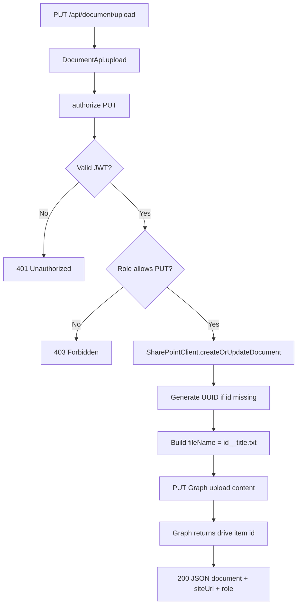
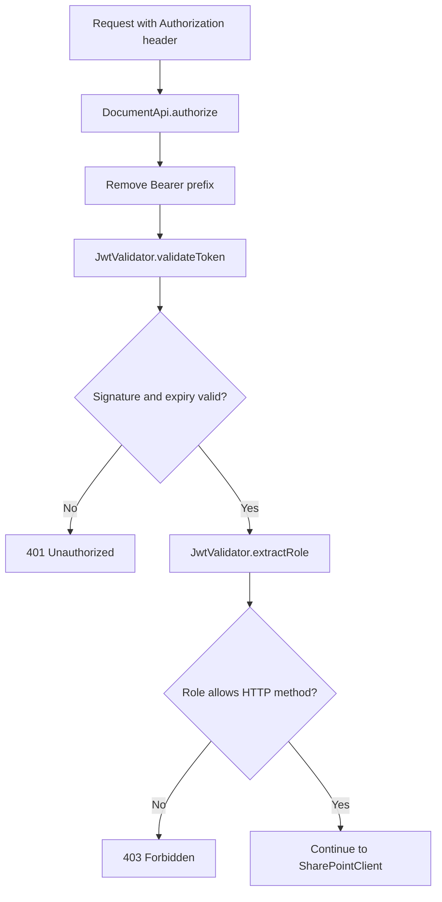

# Interview POC — Real SharePoint + JWT RBAC Flow

> Project: `interview-poc`  
> Runtime tested locally on: `http://localhost:8080`  
> SharePoint target: `https://YOUR-TENANT.sharepoint.com`  
> SharePoint library: `/Shared Documents`  
> Microsoft Graph: `https://graph.microsoft.com/v1.0`  
> Tenant: `YOUR-TENANT.onmicrosoft.com`

---

## 1. High-Level Architecture



---

## 2. Runtime Component Flow



---

## 3. Available Endpoints

Base URL:

```text
http://localhost:8080
```

| Method | Endpoint | Auth | Role | Real SharePoint Call |
|---|---|---:|---|---|
| `GET` | `/api/tokens` | No | Public | No |
| `GET` | `/api/vault/credentials` | No | Public | No |
| `GET` | `/api/document` | Yes | READ/WRITE/ADMIN | Graph list root drive children |
| `GET` | `/api/document/{id}` | Yes | READ/WRITE/ADMIN | Graph get drive item + content |
| `PUT` | `/api/document/upload` | Yes | WRITE/ADMIN | Graph upload file content |
| `DELETE` | `/api/document/{id}` | Yes | ADMIN | Graph delete drive item |

Tested endpoint results:

```text
GET  /api/tokens                 OK
GET  /api/vault/credentials      200
GET  /api/document               200
PUT  /api/document/upload        200 with WRITE token
GET  /api/document/{id}          200 with READ token
PUT  /api/document/upload        403 with READ token
DELETE /api/document/{id}        403 with WRITE token
DELETE /api/document/{id}        200 with ADMIN token
```

---

## 4. Is the API Connected to Real SharePoint?

Yes.

The document endpoints use `SharePointClient` and Microsoft Graph, not local file storage.

### Real SharePoint configuration

```text
Site:        https://YOUR-TENANT.sharepoint.com
Tenant:      YOUR-TENANT.onmicrosoft.com
Library:     /Shared Documents
Graph Base:  https://graph.microsoft.com/v1.0
Auth:        Entra app-only client credentials
```

### Code path

`DocumentApi` receives the HTTP request and calls `SharePointClient`:

- List: `DocumentApi.list()` → `SharePointClient.listDocuments()`
- Get: `DocumentApi.get()` → `SharePointClient.getDocument(id)`
- Upload: `DocumentApi.upload()` → `SharePointClient.createOrUpdateDocument(doc)`
- Delete: `DocumentApi.delete()` → `SharePointClient.deleteDocument(id)`

### Microsoft Graph calls

| API action | Graph call |
|---|---|
| Resolve site | `GET https://graph.microsoft.com/v1.0/sites/{host}:/` |
| List documents | `GET https://graph.microsoft.com/v1.0/sites/{siteId}/drive/root/children` |
| Get document | `GET https://graph.microsoft.com/v1.0/sites/{siteId}/drive/items/{id}` |
| Download content | `GET https://graph.microsoft.com/v1.0/sites/{siteId}/drive/items/{id}/content` |
| Upload content | `PUT https://graph.microsoft.com/v1.0/sites/{siteId}/drive/root:/{fileName}:/content` |
| Delete document | `DELETE https://graph.microsoft.com/v1.0/sites/{siteId}/drive/items/{id}` |

### Token acquisition

`SharePointClient.getAccessToken()` requests an app-only Graph token:

```text
POST https://login.microsoftonline.com/{tenantId}/oauth2/v2.0/token

grant_type=client_credentials
client_id={SHAREPOINT_CLIENT_ID}
client_secret={SHAREPOINT_CLIENT_SECRET}
scope=https://graph.microsoft.com/.default
```

The returned `access_token` is cached until it is close to expiry.

---

## 5. Request Flow Diagrams

### 5.1 List documents



### 5.2 Upload document



### 5.3 Delete document

```mermaid
flowchart TD
    A[DELETE /api/document/{id}] --> B[DocumentApi.delete]
    B --> C[authorize DELETE]
    C --> D{Valid JWT?}
    D -- No --> E[401 Unauthorized]
    D -- Yes --> F{Role allows DELETE?}
    F -- No --> G[403 Forbidden]
    F -- Yes --> H[SharePointClient.deleteDocument]
    H --> I[DELETE Graph drive item]
    I --> J{Graph status}
    J -- 200/204 --> K[200 Document deleted]
    J -- 404 --> L[404 Not found]
    J -- Other error --> M[500 / runtime error]
```

---

## 6. JWT RBAC Flow

### 6.1 Token issuance

`GET /api/tokens` calls `IdentityProvider.issueToken()` for three test clients:

| Token key | Client ID / JWT `sub` | Role claim | Role |
|---|---|---|---|
| `read` | `read-client-poc-001` | `read` | READ |
| `write` | `write-client-poc-002` | `write` | WRITE |
| `admin` | `admin-client-poc-003` | `admin` | ADMIN |

Token format:

```json
{
  "sub": "write-client-poc-002",
  "role": "write",
  "iat": "<issued-at>",
  "exp": "<expires-at>"
}
```

The token is signed with HS256 using the local `jwt.secret`.

### 6.2 Token validation

Every protected endpoint calls:

```text
DocumentApi.authorize(authHeader, method)
  → JwtValidator.validateToken(authHeader)
  → JwtValidator.extractRole(claims)
  → UserRole.allows(method)
```

### 6.3 Role mapping

`UserRole.fromClientId()` maps the JWT subject text:

```text
subject contains "admin" → ADMIN
subject contains "write" → WRITE
otherwise                → READ
```

### 6.4 Role permissions

| Role | GET list | GET one | PUT upload | DELETE |
|---|:---:|:---:|:---:|:---:|
| READ | Yes | Yes | No | No |
| WRITE | Yes | Yes | Yes | No |
| ADMIN | Yes | Yes | Yes | Yes |

### 6.5 RBAC flow



Important: READ/WRITE/ADMIN are application-level roles. SharePoint itself only sees the backend Entra app identity.

---

## 7. Error Handling

| Status | Condition | Example |
|---:|---|---|
| `401` | Missing, malformed, expired, or invalid JWT | READ token missing from protected endpoint |
| `403` | JWT is valid but role cannot perform method | READ token calling `PUT /api/document/upload` |
| `404` | SharePoint drive item not found | `GET /api/document/{unknown-id}` |
| `500` | SharePoint/Graph request failed after valid auth | Graph permission error or network failure |

---

## 8. Configuration

Runtime configuration is read from environment variables first, then vault/config fallback.

| Variable | Purpose |
|---|---|
| `SHAREPOINT_SITE_URL` | SharePoint site URL |
| `SHAREPOINT_TENANT_ID` | Entra tenant name or ID |
| `SHAREPOINT_CLIENT_ID` | Entra app client ID |
| `SHAREPOINT_CLIENT_SECRET` | Entra app client secret |
| `SHAREPOINT_LIBRARY_PATH` | SharePoint library path |
| `SERVER_PORT` | Local HTTP port |

Current target:

```text
SHAREPOINT_SITE_URL=https://YOUR-TENANT.sharepoint.com
SHAREPOINT_TENANT_ID=YOUR-TENANT.onmicrosoft.com
SHAREPOINT_CLIENT_ID=YOUR-CLIENT-ID
SHAREPOINT_LIBRARY_PATH=/Shared Documents
```

Do not write the client secret into this document or commit it to source control.

---

## 9. Local Run Command

From `interview-poc`:

```powershell
$env:SERVER_PORT="8080"
$env:SHAREPOINT_CLIENT_ID="YOUR-CLIENT-ID"
$env:SHAREPOINT_CLIENT_SECRET="<client-secret>"
$env:SHAREPOINT_TENANT_ID="YOUR-TENANT.onmicrosoft.com"
$env:SHAREPOINT_SITE_URL="https://YOUR-TENANT.sharepoint.com"
$env:SHAREPOINT_LIBRARY_PATH="/Shared Documents"

mvn spring-boot:run
```

---

## 10. Docker Notes

Docker image build:

```powershell
docker build -t interview-poc-sharepoint .
```

Docker run:

```powershell
docker run -d -p 8080:8080 `
  -e "SHAREPOINT_CLIENT_ID=YOUR-CLIENT-ID" `
  -e "SHAREPOINT_CLIENT_SECRET=<client-secret>" `
  -e "SHAREPOINT_TENANT_ID=YOUR-TENANT.onmicrosoft.com" `
  -e "SHAREPOINT_SITE_URL=https://YOUR-TENANT.sharepoint.com" `
  -e "SHAREPOINT_LIBRARY_PATH=/Shared Documents" `
  interview-poc-sharepoint
```

Docker networking fix:

```text
JAVA_TOOL_OPTIONS=-Djava.net.preferIPv4Stack=true -Djava.net.preferIPv6Addresses=false
```

This was required because Java in the container tried IPv6 first and failed with `Network unreachable`.

---

## 11. Production Migration Notes

Current POC state:

- REST API is real Spring Boot.
- JWT role management is local POC RBAC.
- SharePoint access is real Microsoft Graph app-only access.
- Vault storage is still local JSON for POC.

Production improvements:

| Area | Current POC | Production Recommendation |
|---|---|---|
| Identity | Local HS256 test JWTs | Azure AD / Entra ID access tokens or RS256 JWTs |
| RBAC | Application-level READ/WRITE/ADMIN | Entra groups, app roles, or policy engine |
| Vault | `data/vault/credentials.json` | Azure Key Vault |
| SharePoint auth | App-only client secret | Client certificate, managed identity, or securely rotated secret |
| Docker networking | IPv4 JVM options added | Keep if IPv6 path is unreliable in target environment |
| Secrets in docs/logs | Masked in API response | Never log client secrets or raw tokens |

---

## 12. File References

| Concern | File |
|---|---|
| REST endpoints | `src/main/java/com/interview/poc/resource/DocumentApi.java` |
| JWT validation | `src/main/java/com/interview/poc/security/JwtValidator.java` |
| Role enum | `src/main/java/com/interview/poc/model/UserRole.java` |
| Test token issuer | `src/main/java/com/interview/poc/auth/IdentityProvider.java` |
| SharePoint Graph client | `src/main/java/com/interview/poc/sharepoint/SharePointClient.java` |
| Vault simulation | `src/main/java/com/interview/poc/vault/VaultService.java` |
| Runtime config | `src/main/resources/application.properties` |
| Docker runtime | `Dockerfile` |
| Compose runtime | `docker-compose.yml` |

---

## 13. Summary

The application now performs real SharePoint CRUD through Microsoft Graph:

```text
Client
  → Spring Boot API
  → JWT role check
  → SharePointClient
  → Entra app-only token
  → Microsoft Graph
  → SharePoint Online / Shared Documents
```

RBAC is enforced before SharePoint calls:

```text
READ  → list/read
WRITE → list/read/upload
ADMIN → list/read/upload/delete
```

SharePoint permissions are granted to the backend Entra app, while READ/WRITE/ADMIN are enforced by the Java API.
